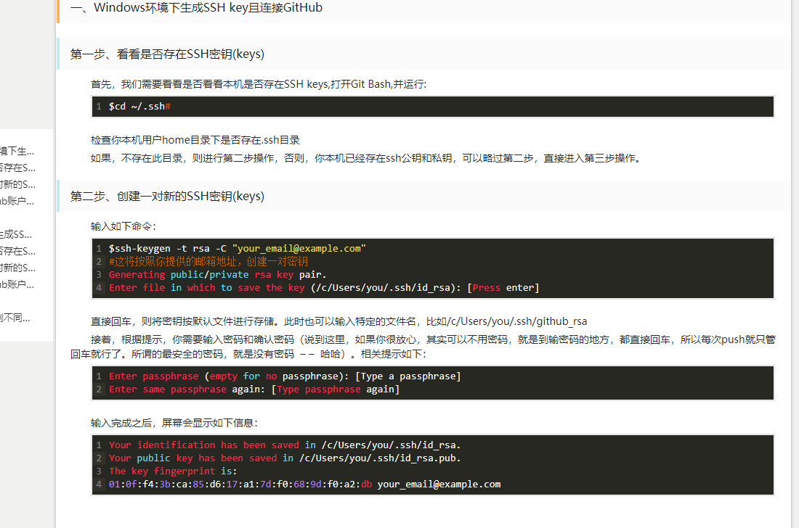

# 工作流程


+ Workspace：工作区
+ Index / Stage：暂存区
+ Repository：仓库区（或本地仓库）
+ Remote：远程仓库

```
	一个版本阶段分为 工作区 add -> 暂存区 commit-> 本地仓库
	head指向当前版本的某个阶段，add就开始一个新的版本。
```

## 本地仓库
1. `git config --global` 参数，有了这个参数，表示你这台机器上所有的Git仓库都会使用这个配置，当然你也可以对某个仓库指定的不同的用户名和邮箱。
2. 本地创建一个版本库，所以创建一个版本库也非常简单，如下我是D盘 –> www下 目录下新建一个testgit版本库，`git init` 生成一个隐藏的`.git`文件
3. `git add 【文件】`添加到暂存区
4. `git commit -m [str]`将暂存区的添加到版本库 -m(message)
5. `git status` 看到工作区的状态
6. `git log` 查看历史提交信息 -g -pretty
7. `git reset --hard HEAD~100`版本回退 --hard 放弃对repositoey和stage、workspace的修改也就是**上一个版本的commitd状态**， --mixed 放弃对repository和stage的修改区的修改,**退会unstaged状态**， --soft **退回到stage uncommited状态**。
8. `git restore<file>” 未commit之前，放弃工作目录中的更改` **--staged**此版本恢复到add之前unstage，head指向工作区，默认放弃此版本的所有head还指向上一个版本时候
9. `rm 【file】` dos操作，删除文件其实也是对版本的**工作区**操作，更新到版本库里只需要按版本提交就好啦。恢复使用 **restore**和**reset**都可以

## 远程仓库

1. 第一步：创建SSH Key。在用户主目录下，看看有没有.ssh目录，如果有，再看看这个目录下有没有id_rsa和id_rsa.pub这两个文件，如果有的话，直接跳过此如下命令，如果没有的话，打开命令行，输入如下命令：*`ssh-keygen -t rsa –C “youremail@example.com”`*



2.
