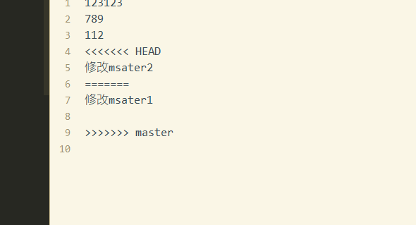

# 工作流程


+ Workspace：工作区
+ Index / Stage：暂存区
+ Repository：仓库区（或本地仓库）
+ Remote：远程仓库

```
	一个版本阶段分为 工作区 add -> 暂存区 commit-> 本地仓库
	head指向当前版本的某个阶段，add就开始一个新的版本。
```

## 本地仓库
1. `git config --global` 参数，有了这个参数，表示你这台机器上所有的Git仓库都会使用这个配置，当然你也可以对某个仓库指定的不同的用户名和邮箱。
2. 本地创建一个版本库，所以创建一个版本库也非常简单，如下我是D盘 –> www下 目录下新建一个testgit版本库，`git init` 生成一个隐藏的`.git`文件
3. `git add 【文件】`添加到暂存区
4. `git commit -m [str]`将暂存区的添加到版本库 -m(message)
5. `git status` 看到工作区的状态
6. `git log` 查看历史提交信息 -g -pretty, `git reflog`可以帮助恢复reset回退问题
7. `git reset --hard HEAD~100`版本回退 --hard 放弃对repositoey和stage、workspace的修改也就是**上一个版本的commitd状态**， --mixed 放弃对repository和stage的修改区的修改,**退会unstaged状态**， --soft **退回到stage uncommited状态**。
8. `git restore<file>” 未commit之前，放弃工作目录中的更改` **--staged**此版本恢复到add之前unstage，head指向工作区，默认放弃此版本的所有head还指向上一个版本时候
9. `rm 【file】` dos操作，删除文件其实也是对版本的**工作区**操作，更新到版本库里只需要按版本提交就好啦。恢复使用 **restore**和**reset**都可以
10. `git rm --cached file_path ****` 删除分支上的，工作树上保留，
11. `git update-index --assume-unchanged [file]` 更新提交索引,`git update-index --no-assume-unchanged [file]` 撤回 
12. [**关于更新所以**](https://www.cnblogs.com/wt645631686/p/10007328.html)

## 远程仓库

1. 第一步：创建SSH Key。在用户主目录下，看看有没有.ssh目录，如果有，再看看这个目录下有没有id_rsa和id_rsa.pub这两个文件，如果有的话，直接跳过此如下命令，如果没有的话，打开命令行，输入如下命令：*`ssh-keygen -t rsa –C “youremail@example.com”`*


2. `git remote add origin 【地址】` 
3. `git checkout -b 【branchName】` 创建并切换分支
4. `git branch` 查看分支
5. `git merge [branchName]` 合并分支 
6. `git branch -d [branchName]` 删除分支
`切换分支的时候必须要提交当前分支的已修改，在分支上创建新的分支其实就是复制当前的分支,bug:合并一次之后又可以切换`
7. 如果有改动冲突需要，在文件中手动解决,**head是当前分支** 
8. 合并有合并模式：默认`Fast-forward `



9. 远程仓库
 + `git remote origin url`
 + `git clone url` 只会创建一个master分支，
 + `git remote`要查看远程库的信息 使用 
 + `git remote –v`要查看远程库的详细信息 使用
 + `git push [远程仓库名字] [远程分支name]`将当前分支push到远程分支
 + `git checkout -b [分支name] rigin/[分支name]`创建远程分支[rigin/dev](https://www.cnblogs.com/huang-dayu/p/8504105.html) 以rigin/[分支name]创建本地[分支name]
 + `-u`参数可以关联远程仓库，push/pull -u  [远程仓库名字] [远程分支name]，git branch -u rigin/[分支name]  [分支name]  switch -t [远程仓库名字] [远程分支name]
 + 隐藏
    - `git stash`
	- `git stash list`
	- `git stash pop`
	- `git stash drop`
	- `git stash aplly`

# git 中会遇到的问题
 + git pull的时候遇到下面的报错。*remote: Repository not found fatal: repository ‘https://github.com/MyRepo/project.git/‘ not found* 解决办法如下,然后再执行git pull就会让你输入账号密码。就可以正常使用啦。 `git credential-manager uninstall`和`git credential-manager install` 原因：错误密码缓存啦
 + 报错*fatal: refusing to merge unrelated histories* 解决：`git pull origin master --allow-unrelated-histories` 原因：本地库和远程库是两个独立存在，不是clone下来的。
 + commit --no-verify 提交时避免验证

	


